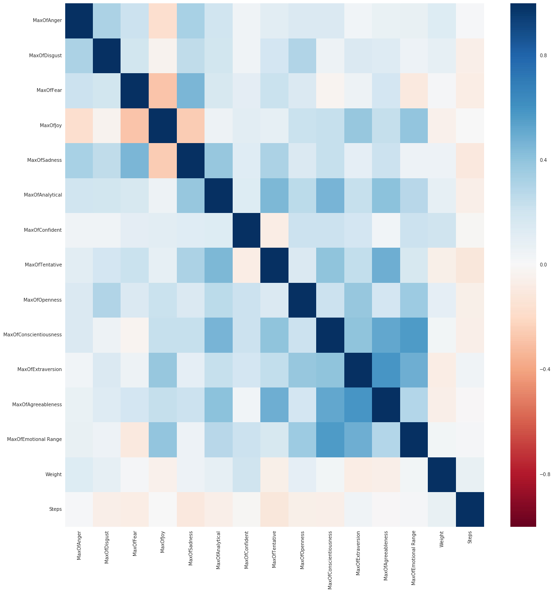

# retrofit
Cognitive Builder Faire Project Analyzing Weight, Steps, and Tone Using IBM Watson. 
By Ammar Darkanzali, Wen Yang, Yune Leou-On, Patrick Park, and Sarang Rakhecha.
Special thanks to Polong Lin and Alex Aklson.

## R App Weight Prediction

## Correlation Heatmap

## Breakfast Food Log NLP Distribution

Weight management is chronic condition impacts more than 60% of the population in the US.  There are a number of programs which have attempted to make an impact.  Over weight is responsible for many conditions.  The team at Cognitive Builder San Francisco assembled quickly to apply learnings obtained from the event on a set of longitudinal dataset.  This included Food log analysis, sentiment analysis of the client/coach conversation for the last 3 years. More over, the team employed the use of Prophet to predict the weight of the user.

1. A wellness company would like to analyze the longitudinal data for each user who are interested in their weight management.

2. We wanted to leverage all the data together to deliver two things, improve the efficiency of the coaches in delivering the service and second, enable the users to experiment with behavior modifications in order to improve the outcomes of their efforts.

3. Analyze correlations and links between different factors and weight/steps.

We utilized DSX, IBM Watson AI Tone Analysis, R Studio, Prophet, Jupyter Notebook, Pandas, Seaborn, and R Shiny to conduct this analysis. 
